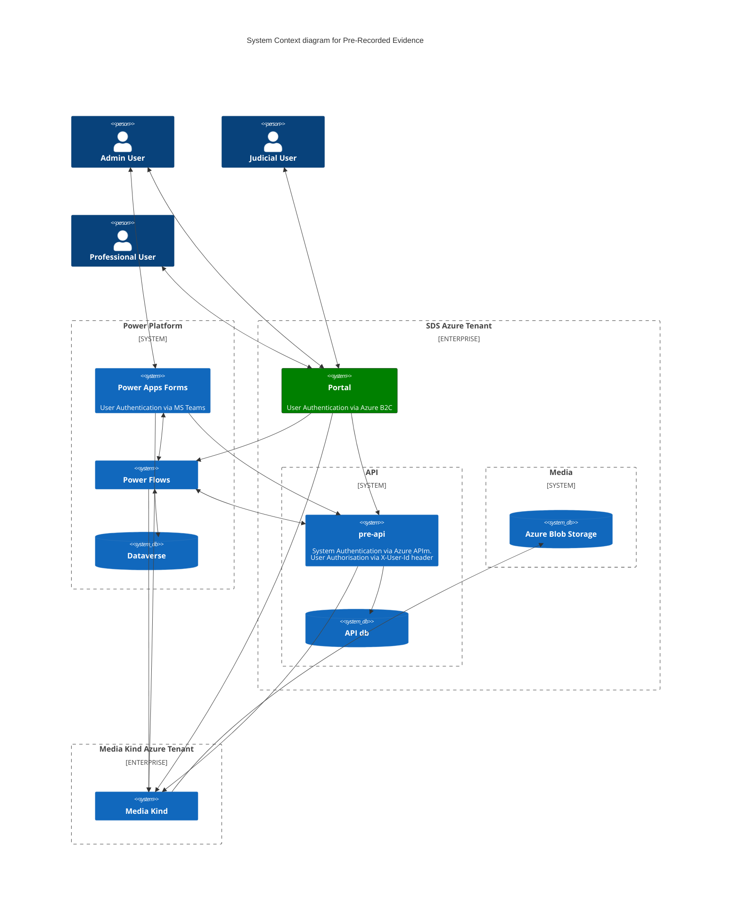

# Pre-Recorded Evidence Portal (pre-portal)

[](https://opensource.org/licenses/MIT) [](https://sonarcloud.io/summary/new_code?id=pre-portal) [](https://sonarcloud.io/summary/new_code?id=pre-portal) [](https://sonarcloud.io/summary/new_code?id=pre-portal) [](https://sonarcloud.io/summary/new_code?id=pre-portal)

## Table of Contents

- [Introduction](#introduction)
  - [Intro to Pre-Recorded Evidence System](#intro-to-pre-recorded-evidence-system)
  - [Purpose](#purpose)
  - [PRE System Diagram (Needs to be updated)](#pre-system-diagram-needs-to-be-updated)
- [Other PRE Repositories](#other-pre-repositories)
- [Running the application Locally](#running-the-application-locally)
  - [Prerequisites](#prerequisites)
  - [Install Dependencies and Build](#install-dependencies-and-build)
  - [Start the Application](#start-the-application)
    - [With the Command Line](#with-the-command-line)
    - [With IntelliJ IDEA](#with-intellij-idea)
- [Developing for Pre Portal](#developing-for-pre-portal)
  - [Logging into the application](#logging-into-the-application)
  - [Code style](#code-style)
  - [Running the tests](#running-the-tests)
    - [Unit Tests](#unit-tests)
    - [Functional Tests](#functional-tests)
    - [Accessibility Tests](#accessibility-tests)
  - [Security](#security)
    - [CSRF prevention](#csrf-prevention)
    - [Helmet](#helmet)
  - [Healthcheck](#healthcheck)
- [Troubleshooting](#troubleshooting)
  - [Common issues](#common-issues)
    - [Error: checks.state argument is missing](#error-checksstate-argument-is-missing)

## Introduction

### Intro to Pre-Recorded Evidence System

The Pre-Recorded Evidence (PRE) system is a new service that allows the capturing of a video recorded hearing or testimony,
and allows this recording to be securely shared to advocates, or played back in court. You can learn more about the service
[here](https://tools.hmcts.net/confluence/display/S28/Pre-Recorded+Evidence).

### Purpose

This code repository contains the source code for the Pre-Recorded Evidence Portal. The Portal provides a secure interface
for professional and judicial users to login, browse and watch recordings which have been shared with them.

### PRE System Diagram (Needs to be updated)

This diagram gives an overview of the PRE system which the pre-portal connects to in its current state (not yet live).



## Other PRE Repositories

- [PRE Power Platform Frontend](https://github.com/hmcts/pre-power-platform)
- [PRE Shared Infrastructure](https://github.com/hmcts/pre-shared-infrastructure)
- [PRE Function Apps](https://github.com/hmcts/pre-functions)
- [PRE API](https://github.com/hmcts/pre-api)

## Running the application Locally

### Prerequisites

Running the application requires the following tools to be installed in your environment:

- [Node.js](https://nodejs.org/) v22.15.0 or later (due to ESM and CJS compatibility)
- [yarn](https://yarnpkg.com/)
- [Docker](https://www.docker.com)

Before running the application, you need to set up the environment variables. Create a `.env` file in the root of the project.
You can get the variables and values to fill your `.env` file with from one of the [PRE developers](https://github.com/orgs/hmcts/teams/pre-rec-evidence).

Pre Portal requires the Pre API to be running. You can run it locally by following the instructions in the
[pre-api repository](https://github.com/hmcts/pre-api). Or you can use the staging environment Pre API by setting the
`PRE_API_URL` environment variable to the staging API URL in the `.env` file.

#### Install Dependencies and Build

You can install the dependencies using `yarn` package manager.

```bash
yarn install
```

Compile the Typescript files/assets and bundle the application using Webpack:

```bash
yarn webpack
```

### Start the Application

#### With the Command Line

Load your environment variables from the `.env` file:

```bash
export $(grep -v '^#' .env | xargs -0)
```

Run the application:

```bash
yarn start:dev
```

The applications's home page will be available at https://localhost:4551

### With IntelliJ IDEA

Copy the contents of the `.env` file.

Click on `Modify Run Configuration`.

Next to the `Environment Variables` field click on the clipboard icon and paste the contents of the `.env` file.

Open the `package.json` file and right-click on the `start:dev` script.

Click on the `Run 'start:dev'` button.

## Developing for Pre Portal

### Logging into the application

To access the portal you will need to login. When you start the application and go to [home page](https://localhost:4551)
you will be redirected to an Azure B2C login screen. The login credentials you use will need to have permission to use PRE Portal.
A PRE developer should be able to provide you with a test user to login to the portal with. If you are not able to login,
please contact one of the [PRE developers](https://github.com/orgs/hmcts/teams/pre-rec-evidence)

### Code style

We use [ESLint](https://github.com/typescript-eslint/typescript-eslint)
alongside [sass-lint](https://github.com/sasstools/sass-lint)

Running the linting with auto fix:

```bash
yarn lint --write
```

### Running the tests

This template app uses [Jest](https://jestjs.io//) as the test engine.

Important: Currently, Jest is incompatible with ESM modules. Babel has been implemented to transform ESM modules to enable compatibility.

You can run unit tests by executing the following command:

#### Unit Tests

```bash
yarn test:unit
```

#### Functional Tests

```bash
yarn test:functional
```

#### Accessibility Tests

Running accessibility tests:

```bash
yarn test:pa11y
```

Accessibility tests (see [a11y.ts](src/test/a11y/a11y.ts)) make use of the accessibility library Pa11y.
All paths in PRE Portal should be tested for accessibility issues.

**Puppeteer Usage Over Playwright**

The accessibility tests use [Puppeteer](https://pptr.dev/) to run a headless browser. This is because pa11y does [not
seem currently compatible](https://github.com/pa11y/pa11y/issues/656#issuecomment-1262418060) with Playwright browser
contexts and the current tests have complexities (conditional logic, dynamic IDs, etc) that make them difficult to convert to Pa11y
[actions](https://github.com/pa11y/pa11y?tab=readme-ov-file#actions).

These will be converted to Playwright in upcoming work.

#### Help! my tests are not running

If the `PRE_API_URL` value in your `.env` file is set with `PRE_API_URL=http://localhost:4550/`:
1. Have you started your Docker engine?
2. Are your Docker containers running? (from your local PRE API repository, run `docker-compose up -d`)
3. Have you started up PRE API locally? (from your local PRE API repository, run `./gradlew bootRun`)

Wherever your PRE_API_URL is pointing, you will need to:
1. Connect to the [F5 VPN](https://portal.platform.hmcts.net/vdesk/webtop.eui?webtop=/Common/webtop_full&webtop_type=webtop_full) so that you can access staging resources e.g. B2C for logging in.
2. Check you have put sensible variables into your `.env` file (ask another dev)
3. Export these variables with `export $(grep -v '^#' .env | xargs -0)` whenever the env file has changed or whenever you open a new Terminal

### Security

#### CSRF prevention

[Cross-Site Request Forgery](https://github.com/pillarjs/understanding-csrf) prevention has already been
set up at the application level. However, you need to make sure that CSRF token
is present in every HTML form that requires it. For that purpose you can use the `csrfProtection` macro,
included in `[csrf.njk](src/main/views/macros/csrf.njk)`. Your njk file would look like this:

```

...
<form ...>
  ...
    {{ csrfProtection(csrfToken) }}
  ...
</form>
...
```

#### Helmet

This application uses [Helmet](https://helmetjs.github.io/), which adds various security-related HTTP headers
to the responses. Apart from default Helmet functions, following headers are set:

- [Referrer-Policy](https://helmetjs.github.io/docs/referrer-policy/)
- [Content-Security-Policy](https://helmetjs.github.io/docs/csp/)

There is a configuration section related with those headers, where you can specify:

- `referrerPolicy` - value of the `Referrer-Policy` header

Here's an example setup:

```json
    "security": {
      "referrerPolicy": "origin"
    }
```

Make sure you have those values set correctly for your application.

### Healthcheck

The application exposes a health endpoint (https://localhost:4551/health), created with the use of
[Nodejs Healthcheck](https://github.com/hmcts/nodejs-healthcheck) library. This endpoint is defined
in [health.ts](src/main/routes/health.ts) file. Make sure you adjust it correctly in your application.
In particular, remember to replace the sample check with checks specific to your frontend app,
e.g. the ones verifying the state of each service it depends on.

### Altering the sign-in page

The sign in page is provided by Azure B2C. The code for it is in https://github.com/hmcts/pre-shared-infrastructure/tree/master/b2c. Make sure you read the [README](https://github.com/hmcts/pre-shared-infrastructure/blob/master/b2c/README.md) first.

### Testing with the DEV instance of B2C

Sometimes you'll be making changes to B2C and you'll want a frontend available which points to it.

To point the pre-portal at the dev B2C instance you simply need to add the tag `pr-values: devb2c`
to the GitHub PR you are working on. Instructions on how this works can be found
[here](https://hmcts.github.io/cloud-native-platform/new-component/helm-chart.html#what-are-values-template-yaml-for).

## Troubleshooting

### Common issues

#### Error: checks.state argument is missing

This error can occur when PRE API is not reachable. Make sure you have the API running and that the URL in the `.env` file is correct.
You can check if the API is running by visiting the health endpoint in your browser: `https://localhost:4551/health`.
If the API is running, you should see a JSON response with the status of "pre-api" being "UP".

## License

This project is licensed under the MIT License - see the [LICENSE](LICENSE) file for details
